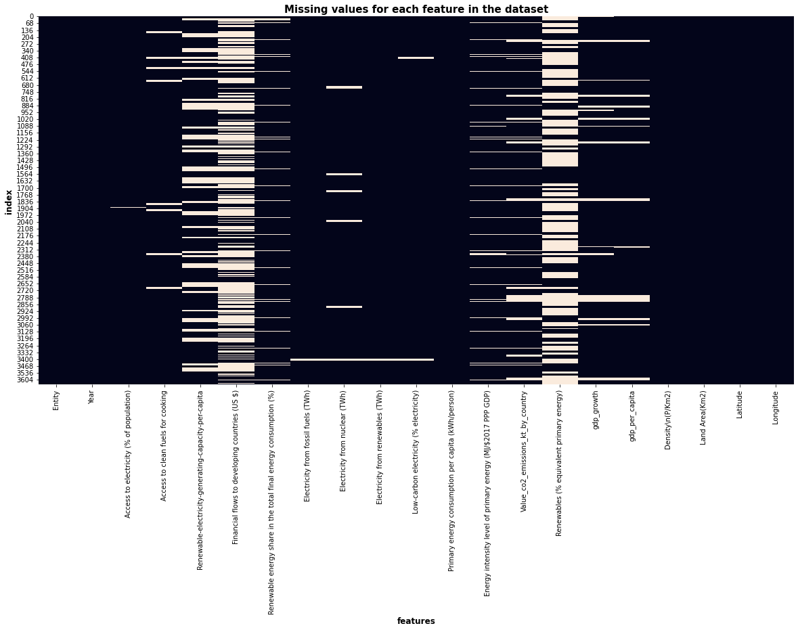
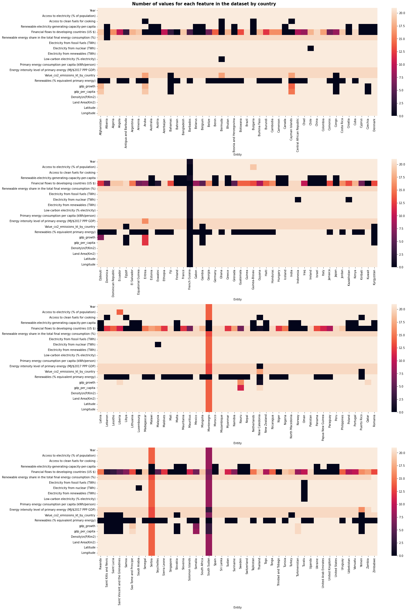

The aim of this notebook is to provide some description of the dataset that I will use for my project.

## 1. How were the data obtained ?

### Data sources

This dataset was obtained from 3 different sources:

- [World Bank](https://www.worldbank.org/en/home)
- [International Energy Agency](https://www.iea.org/data-and-statistics/data-product/world-energy-investment-2021-datafile)
- [Our World in Data](https://ourworldindata.org/renewable-energy)

### Data collection

#### The World Bank

The _World Bank_ gets its data from different reliable sources and surveys. To compile data, they use the following methodologies:

- **Data Consistency**: Data from different sources may have inconsistencies due to differences in timing and reporting practices. The World Bank attempts to present data consistently in terms of definition, timing, and methods in its publications.
- **Change in Terminology**: The _World Bank_ has adopted new terminology in line with the 1993 System of National Accounts (SNA). This includes changes in the names of economic indicators, such as GNP becoming GNI, GNP per capita becoming GNI per capita, and others.
- **Aggregation Rules**: Aggregates in _World Bank_ data are based on regional and income classifications of economies. They are approximations of unknown totals or average values due to missing data.
- **Growth Rates**: Growth rates are calculated as annual averages and represented as percentages using methods like least squares, exponential endpoint, and geometric endpoint.
- **Alternative Conversion Factors**: In cases where official exchange rates are deemed unreliable, alternative conversion factors are used to provide a more accurate representation of currency values for specific countries.

#### The International Energy Agency

The _International Energy Agency_ provides datasets about energy through different sectors (Industry, Residential, Services and Transport). They use administrative sources, measurements and surveys to collect data. A list of all their data collection practices can be fond [here](https://www.iea.org/data-and-statistics/data-tools/national-data-collection-practices?).

#### Our World in Data

_Our World in Data_ is gathering the most dependable and enlightening data sets related to a specific subject. Their sources are the following ones:

- Specialized institutions, such as the Peace Research Institute Oslo (PRIO).
- Research articles.
- International organizations and statistical agencies, including the OECD, the World Bank, and UN institutions.
- Official data obtained from government sources.

## 2. Data types

```python
import pandas as pd

# Read the dataset
df = pd.read_csv("../data/global-data-on-sustainable-energy.csv")
df
```

<div>
<style scoped>
    .dataframe tbody tr th:only-of-type {
        vertical-align: middle;
    }

    .dataframe tbody tr th {
        vertical-align: top;
    }

    .dataframe thead th {
        text-align: right;
    }

</style>
<table border="1" class="dataframe">
  <thead>
    <tr style="text-align: right;">
      <th></th>
      <th>Entity</th>
      <th>Year</th>
      <th>Access to electricity (% of population)</th>
      <th>Access to clean fuels for cooking</th>
      <th>Renewable-electricity-generating-capacity-per-capita</th>
      <th>Financial flows to developing countries (US $)</th>
      <th>Renewable energy share in the total final energy consumption (%)</th>
      <th>Electricity from fossil fuels (TWh)</th>
      <th>Electricity from nuclear (TWh)</th>
      <th>Electricity from renewables (TWh)</th>
      <th>...</th>
      <th>Primary energy consumption per capita (kWh/person)</th>
      <th>Energy intensity level of primary energy (MJ/$2017 PPP GDP)</th>
      <th>Value_co2_emissions_kt_by_country</th>
      <th>Renewables (% equivalent primary energy)</th>
      <th>gdp_growth</th>
      <th>gdp_per_capita</th>
      <th>Density\n(P/Km2)</th>
      <th>Land Area(Km2)</th>
      <th>Latitude</th>
      <th>Longitude</th>
    </tr>
  </thead>
  <tbody>
    <tr>
      <th>0</th>
      <td>Afghanistan</td>
      <td>2000</td>
      <td>1.613591</td>
      <td>6.2</td>
      <td>9.22</td>
      <td>20000.0</td>
      <td>44.99</td>
      <td>0.16</td>
      <td>0.0</td>
      <td>0.31</td>
      <td>...</td>
      <td>302.59482</td>
      <td>1.64</td>
      <td>760.000000</td>
      <td>NaN</td>
      <td>NaN</td>
      <td>NaN</td>
      <td>60</td>
      <td>652230.0</td>
      <td>33.939110</td>
      <td>67.709953</td>
    </tr>
    <tr>
      <th>1</th>
      <td>Afghanistan</td>
      <td>2001</td>
      <td>4.074574</td>
      <td>7.2</td>
      <td>8.86</td>
      <td>130000.0</td>
      <td>45.60</td>
      <td>0.09</td>
      <td>0.0</td>
      <td>0.50</td>
      <td>...</td>
      <td>236.89185</td>
      <td>1.74</td>
      <td>730.000000</td>
      <td>NaN</td>
      <td>NaN</td>
      <td>NaN</td>
      <td>60</td>
      <td>652230.0</td>
      <td>33.939110</td>
      <td>67.709953</td>
    </tr>
    <tr>
      <th>2</th>
      <td>Afghanistan</td>
      <td>2002</td>
      <td>9.409158</td>
      <td>8.2</td>
      <td>8.47</td>
      <td>3950000.0</td>
      <td>37.83</td>
      <td>0.13</td>
      <td>0.0</td>
      <td>0.56</td>
      <td>...</td>
      <td>210.86215</td>
      <td>1.40</td>
      <td>1029.999971</td>
      <td>NaN</td>
      <td>NaN</td>
      <td>179.426579</td>
      <td>60</td>
      <td>652230.0</td>
      <td>33.939110</td>
      <td>67.709953</td>
    </tr>
    <tr>
      <th>3</th>
      <td>Afghanistan</td>
      <td>2003</td>
      <td>14.738506</td>
      <td>9.5</td>
      <td>8.09</td>
      <td>25970000.0</td>
      <td>36.66</td>
      <td>0.31</td>
      <td>0.0</td>
      <td>0.63</td>
      <td>...</td>
      <td>229.96822</td>
      <td>1.40</td>
      <td>1220.000029</td>
      <td>NaN</td>
      <td>8.832278</td>
      <td>190.683814</td>
      <td>60</td>
      <td>652230.0</td>
      <td>33.939110</td>
      <td>67.709953</td>
    </tr>
    <tr>
      <th>4</th>
      <td>Afghanistan</td>
      <td>2004</td>
      <td>20.064968</td>
      <td>10.9</td>
      <td>7.75</td>
      <td>NaN</td>
      <td>44.24</td>
      <td>0.33</td>
      <td>0.0</td>
      <td>0.56</td>
      <td>...</td>
      <td>204.23125</td>
      <td>1.20</td>
      <td>1029.999971</td>
      <td>NaN</td>
      <td>1.414118</td>
      <td>211.382074</td>
      <td>60</td>
      <td>652230.0</td>
      <td>33.939110</td>
      <td>67.709953</td>
    </tr>
    <tr>
      <th>...</th>
      <td>...</td>
      <td>...</td>
      <td>...</td>
      <td>...</td>
      <td>...</td>
      <td>...</td>
      <td>...</td>
      <td>...</td>
      <td>...</td>
      <td>...</td>
      <td>...</td>
      <td>...</td>
      <td>...</td>
      <td>...</td>
      <td>...</td>
      <td>...</td>
      <td>...</td>
      <td>...</td>
      <td>...</td>
      <td>...</td>
      <td>...</td>
    </tr>
    <tr>
      <th>3644</th>
      <td>Zimbabwe</td>
      <td>2016</td>
      <td>42.561730</td>
      <td>29.8</td>
      <td>62.88</td>
      <td>30000.0</td>
      <td>81.90</td>
      <td>3.50</td>
      <td>0.0</td>
      <td>3.32</td>
      <td>...</td>
      <td>3227.68020</td>
      <td>10.00</td>
      <td>11020.000460</td>
      <td>NaN</td>
      <td>0.755869</td>
      <td>1464.588957</td>
      <td>38</td>
      <td>390757.0</td>
      <td>-19.015438</td>
      <td>29.154857</td>
    </tr>
    <tr>
      <th>3645</th>
      <td>Zimbabwe</td>
      <td>2017</td>
      <td>44.178635</td>
      <td>29.8</td>
      <td>62.33</td>
      <td>5570000.0</td>
      <td>82.46</td>
      <td>3.05</td>
      <td>0.0</td>
      <td>4.30</td>
      <td>...</td>
      <td>3068.01150</td>
      <td>9.51</td>
      <td>10340.000150</td>
      <td>NaN</td>
      <td>4.709492</td>
      <td>1235.189032</td>
      <td>38</td>
      <td>390757.0</td>
      <td>-19.015438</td>
      <td>29.154857</td>
    </tr>
    <tr>
      <th>3646</th>
      <td>Zimbabwe</td>
      <td>2018</td>
      <td>45.572647</td>
      <td>29.9</td>
      <td>82.53</td>
      <td>10000.0</td>
      <td>80.23</td>
      <td>3.73</td>
      <td>0.0</td>
      <td>5.46</td>
      <td>...</td>
      <td>3441.98580</td>
      <td>9.83</td>
      <td>12380.000110</td>
      <td>NaN</td>
      <td>4.824211</td>
      <td>1254.642265</td>
      <td>38</td>
      <td>390757.0</td>
      <td>-19.015438</td>
      <td>29.154857</td>
    </tr>
    <tr>
      <th>3647</th>
      <td>Zimbabwe</td>
      <td>2019</td>
      <td>46.781475</td>
      <td>30.1</td>
      <td>81.40</td>
      <td>250000.0</td>
      <td>81.50</td>
      <td>3.66</td>
      <td>0.0</td>
      <td>4.58</td>
      <td>...</td>
      <td>3003.65530</td>
      <td>10.47</td>
      <td>11760.000230</td>
      <td>NaN</td>
      <td>-6.144236</td>
      <td>1316.740657</td>
      <td>38</td>
      <td>390757.0</td>
      <td>-19.015438</td>
      <td>29.154857</td>
    </tr>
    <tr>
      <th>3648</th>
      <td>Zimbabwe</td>
      <td>2020</td>
      <td>52.747670</td>
      <td>30.4</td>
      <td>80.61</td>
      <td>30000.0</td>
      <td>81.90</td>
      <td>3.40</td>
      <td>0.0</td>
      <td>4.19</td>
      <td>...</td>
      <td>2680.13180</td>
      <td>10.00</td>
      <td>NaN</td>
      <td>NaN</td>
      <td>-6.248748</td>
      <td>1214.509820</td>
      <td>38</td>
      <td>390757.0</td>
      <td>-19.015438</td>
      <td>29.154857</td>
    </tr>
  </tbody>
</table>
<p>3649 rows × 21 columns</p>
</div>

Our dataset contains 3649 entries for 21 features. Let's take a deeper look at the data types of each feature.

```python
df.dtypes
```

    Entity                                                               object
    Year                                                                  int64
    Access to electricity (% of population)                             float64
    Access to clean fuels for cooking                                   float64
    Renewable-electricity-generating-capacity-per-capita                float64
    Financial flows to developing countries (US $)                      float64
    Renewable energy share in the total final energy consumption (%)    float64
    Electricity from fossil fuels (TWh)                                 float64
    Electricity from nuclear (TWh)                                      float64
    Electricity from renewables (TWh)                                   float64
    Low-carbon electricity (% electricity)                              float64
    Primary energy consumption per capita (kWh/person)                  float64
    Energy intensity level of primary energy (MJ/$2017 PPP GDP)         float64
    Value_co2_emissions_kt_by_country                                   float64
    Renewables (% equivalent primary energy)                            float64
    gdp_growth                                                          float64
    gdp_per_capita                                                      float64
    Density\n(P/Km2)                                                     object
    Land Area(Km2)                                                      float64
    Latitude                                                            float64
    Longitude                                                           float64
    dtype: object

This dataset mainle containes Time Series data. Most of the features are measurements taken at different points in time (each year), grouped by country. The only exception is the `Entity` feature, which is a categorical feature. We can also pinpoint that the `Density` feature has a weird data type: `object`. Usually, a density muste be given as a number (a int or a float). Let's take a look at the values of this feature.

```python
df['Density\\n(P/Km2)'].unique()
```

    array(['60', '105', '18', '26', '223', '17', '104', '590', '3', '109',
           '123', '41', '2,239', '1,265', '668', '47', '383', '108', '1281',
           '20', '64', '4', '25', '76', '463', '95', '56', '274', '8', '13',
           '153', '46', '467', '100', '73', '106', '131', '136', '137', '43',
           '96', '225', '71', '103', '313', '50', '35', '31', '67', '115',
           '49', '119', nan, '9', '239', '57', '240', '81', '331', '167',
           '53', '70', '414', '89', '107', '464', '151', '93', '400', '206',
           '273', '347', '7', '94', '147', '34', '30', '667', '242', '48',
           '203', '99', '1,802', '1,380', '5', '626', '66', '2', '83', '40',
           '541', '508', '16', '55', '19', '226', '15', '287', '58', '368',
           '124', '111', '248', '84', '525', '205', '301', '284', '87', '214',
           '8,358', '114', '341', '219', '68', '152', '110', '393', '229',
           '75', '118', '281', '36', '79', '38'], dtype=object)

The `Density` feature contains numbers represented as strings. This will be a problem for our analysis and modeling. We will have to convert this feature to a numeric type.

## 3. Features

```python
df.info()
```

    <class 'pandas.core.frame.DataFrame'>
    RangeIndex: 3649 entries, 0 to 3648
    Data columns (total 21 columns):
     #   Column                                                            Non-Null Count  Dtype
    ---  ------                                                            --------------  -----
     0   Entity                                                            3649 non-null   object
     1   Year                                                              3649 non-null   int64
     2   Access to electricity (% of population)                           3639 non-null   float64
     3   Access to clean fuels for cooking                                 3480 non-null   float64
     4   Renewable-electricity-generating-capacity-per-capita              2718 non-null   float64
     5   Financial flows to developing countries (US $)                    1560 non-null   float64
     6   Renewable energy share in the total final energy consumption (%)  3455 non-null   float64
     7   Electricity from fossil fuels (TWh)                               3628 non-null   float64
     8   Electricity from nuclear (TWh)                                    3523 non-null   float64
     9   Electricity from renewables (TWh)                                 3628 non-null   float64
     10  Low-carbon electricity (% electricity)                            3607 non-null   float64
     11  Primary energy consumption per capita (kWh/person)                3649 non-null   float64
     12  Energy intensity level of primary energy (MJ/$2017 PPP GDP)       3442 non-null   float64
     13  Value_co2_emissions_kt_by_country                                 3221 non-null   float64
     14  Renewables (% equivalent primary energy)                          1512 non-null   float64
     15  gdp_growth                                                        3332 non-null   float64
     16  gdp_per_capita                                                    3367 non-null   float64
     17  Density\n(P/Km2)                                                  3648 non-null   object
     18  Land Area(Km2)                                                    3648 non-null   float64
     19  Latitude                                                          3648 non-null   float64
     20  Longitude                                                         3648 non-null   float64
    dtypes: float64(18), int64(1), object(2)
    memory usage: 598.8+ KB

We can separate the features into 3 categories:

- Potential factors: these features are independant variables.
- Cofactors: these features are variables that may influence the response variable.
- Response: these features are the ones we might want to predict.

Depending on the question we want to answer, we will use different features. For example, if we want to predict the carbon emissions of a country, we will use the `Value_co2_emissions_kt_by_country` feature as the response variable and the `Electricity from fossil fuels (TWh)` feature as a cofactor. If we want to classify the access to renewable energy, the `Access to clean fuels for cooking` feature will be the response variable and the `Renewable energy share in the total final energy consumption (%)` feature will be a cofactor.

So, it is quite a bit hard to say which features are potential factors, cofactors or response variables. We can still make a table like this one:

| Features                                                         | Potential Factors | Cofactors | Response |
| ---------------------------------------------------------------- | :---------------: | :-------: | :------: |
| Year                                                             |         X         |           |          |
| Access to electricity (% of population)                          |         X         |     X     |          |
| Access to clean fuels for cooking                                |         X         |     X     |    X     |
| Renewable-electricity-generating-capacity-per-capita             |         X         |     X     |          |
| Financial flows to developing countries (US $)                   |         X         |     X     |    X     |
| Renewable energy share in the total final energy consumption (%) |         X         |     X     |    X     |
| Electricity from fossil fuels (TWh)                              |         X         |     X     |          |
| Electricity from nuclear (TWh)                                   |         X         |     X     |          |
| Electricity from renewables (TWh)                                |         X         |     X     |          |
| Low-carbon electricity (% electricity)                           |         X         |     X     |    X     |
| Primary energy consumption per capita (kWh/person)               |         X         |     X     |          |
| Energy intensity level of primary energy (MJ/$2017 PPP GDP)      |         X         |     X     |          |
| Renewables (% equivalent primary energy)                         |         X         |     X     |    X     |
| GDP growth                                                       |         X         |     X     |          |
| GDP per capita                                                   |         X         |     X     |          |
| Density (P/km2)                                                  |         X         |     X     |          |
| Land Area (Km2)                                                  |         X         |           |          |
| Latitude                                                         |         X         |           |          |
| Longitude                                                        |         X         |           |          |
| Value_co2_emissions_kt_by_country                                |                   |           |    X     |

## 4. Overall data dimension

```python
df.shape
```

    (3649, 21)

The dataset contains 3649 entries for 21 features !

## 5. Missing values

Let's take a look at the missing values in our dataset. We will use `seaborn` to plot those missing values.

```python
import seaborn as sns
import matplotlib.pyplot as plt
```

```python
plt.figure(figsize=(20,10))
sns.heatmap(df.isnull(), cbar=False)
plt.ylabel('index', fontweight='bold', fontsize=12)
plt.xlabel('features', fontweight='bold', fontsize=12)
plt.title('Missing values for each feature in the dataset', fontweight='bold', fontsize=15)
```

<p align="center">
  
</p>

We can clearly see that some features are densed and other are sparsed. Heavily sparsed features (features that we might drop) are the following ones:

- Renewable-electricity-generating-capacity-per-capita
- Financial flows to developing countries (US $)
- Value_co2_emissions_kt_by_country
- Renewables (% equivalent primary energy)

Let's not forget that the entries of the dataset can easily be grouped by countries. We can guess that those thin lines of missing values that we see in the figure might correspond to some years where we don't have data. Thick block of missing values could mean that the country doesn't have any data for this feature.

The `groupby.count()` pandas' method compute count of group, excluding missing values. We know that the dataset is providing 21 years of data for each country. So, we can use this method to check if we have missing values for some countries.

```python
df_count_values_by_country = df.groupby('Entity').count()
df_count_values_by_country.shape
```

    (176, 20)

```python
fig = plt.figure(layout='constrained', figsize=(20, 30))
axs = fig.subplot_mosaic("""A;B;C;D""")

sns.heatmap(df_count_values_by_country.iloc[:44].T, xticklabels=True, yticklabels=True, ax=axs['A'])
sns.heatmap(df_count_values_by_country.iloc[44:88].T, xticklabels=True, yticklabels=True, ax=axs['B'])
sns.heatmap(df_count_values_by_country.iloc[88:132].T, xticklabels=True, yticklabels=True, ax=axs['C'])
sns.heatmap(df_count_values_by_country.iloc[132:].T, xticklabels=True, yticklabels=True, ax=axs['D'])

fig.suptitle('Number of values for each feature in the dataset by country', fontweight='bold', fontsize=15)
```

<p align="center">
  
</p>

We can pinpoint some countries that gave a lot of missing values for all the features:

- French Guiana
- Montenegro
- Serbia
- South Sudan

We also have features that have the same amount of missing values across all the countries. This would mean that those data were not collected for a specific range of years. The features that have this behavior are the following ones:

- Renewable energy share in the total final energy consumption
- Energy intensity level of primary energy (MJ/$2017 PPP GDP)
- Value_co2_emissions_kt_by_country

Features that are not heavily sparsed might be imputed in the process of modeling:

- Access to clean fuels for cooking
- Electricity from nuclear (TWh)
- Electricity from renewables (TWh)
- Low-carbon electricity (% electricity)
- GDP growth
- GDP per capita
